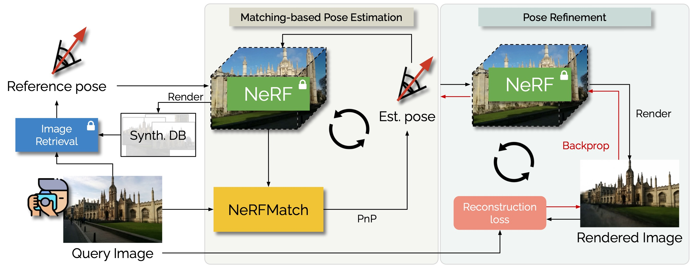

#  NeRFMatch
This repository contains the code release of our paper accepted at _ECCV2024_: 

**The NeRFect Match: Exploring NeRF Features for Visual Localization**. [[Project Page](https://nerfmatch.github.io) | [Paper](https://arxiv.org/pdf/2403.09577) | [Poster](https://nerfmatch.github.io/static/images/the_nerfect_match.pdf)]

<!--  -->
<p align="center">

</p>


## Installation
Clone this repository and create a conda envoirnment with the following commands:
```
# Create conda env
conda env create -f configs/conda/nerfmatch_env.yml
conda activate neumatch
pip install -r configs/conda/requirements.txt

# Install this repo
pip install -e .
```


## Data Preparation

- Download the **7-Scenes** dataset from [this link](https://www.microsoft.com/en-us/research/project/rgb-d-dataset-7-scenes/) and place them under _data/7scenes_ .

- Download the **Cambridge Landmarks** scenes ([Great Court](https://www.repository.cam.ac.uk/handle/1810/251291), [Kings College](https://www.repository.cam.ac.uk/handle/1810/251342), [Old Hospital](https://www.repository.cam.ac.uk/handle/1810/251340), [Shop Facade](https://www.repository.cam.ac.uk/handle/1810/251336), [St. Marys Church](https://www.repository.cam.ac.uk/handle/1810/251294)) and place them under _data/cambrdige_.

- Execute the following command to download our pre-process data annotations and image retrieval pairs and SAM masks on Cambridge Landmarks for NeRF training. The Cambridge Landmarks annotations are converted from original dataset nvm file.  7-Scenes sfm ground truth json files are converted from [pgt/sfm/7scenes](https://github.com/tsattler/visloc_pseudo_gt_limitations/tree/main/pgt/sfm/7scenes).
```
cd data/
bash download_data.sh
cd  ..
```

- Execute the following command to download our pretrained nerf and nerfmatch models. 
```
cd pretrained/
bash download_pretrained.sh
cd  ..
```
After those preparation steps, your _data/_ directory shall look like:
```
data
├── 7scenes
│   ├── chess
│   └── ...
├── annotations
│   └── 7scenes_jsons/sfm
│       ├── transforms_*_test.json
│       ├── transforms_*_train.json
│       └── ...
├── cambridge
│   ├── GreatCourt
│   └── ...
├── mask_preprocessed
│   └── cambridge
└── pairs
    ├── 7scenes    
    └── cambridge

```

## Training and Evaluation
We refer users to [model_train/README.md](model_train/README.md) and [model_eval/README.md](model_eval/README.md) for training and evaluation instructions.


## Licenses
The source code is released under [NVIDIA Source Code License v1](LICENSE.txt). 
The pretrained models are released under [CC BY-NC-SA 4.0](pretrained/LICENSE.txt).

## Citation
If you are using our method, please cite:
```
@article{zhou2024nerfmatch,
  title={The NeRFect match: Exploring NeRF features for visual localization},
  author={Zhou, Qunjie and Maximov, Maxim and Litany, Or and Leal-Taix{\'e}, Laura},
  journal={European Conference on Computer Vision},
  year={2024}
}
```
